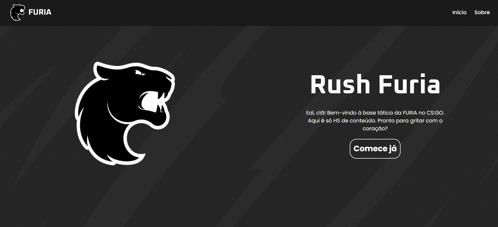
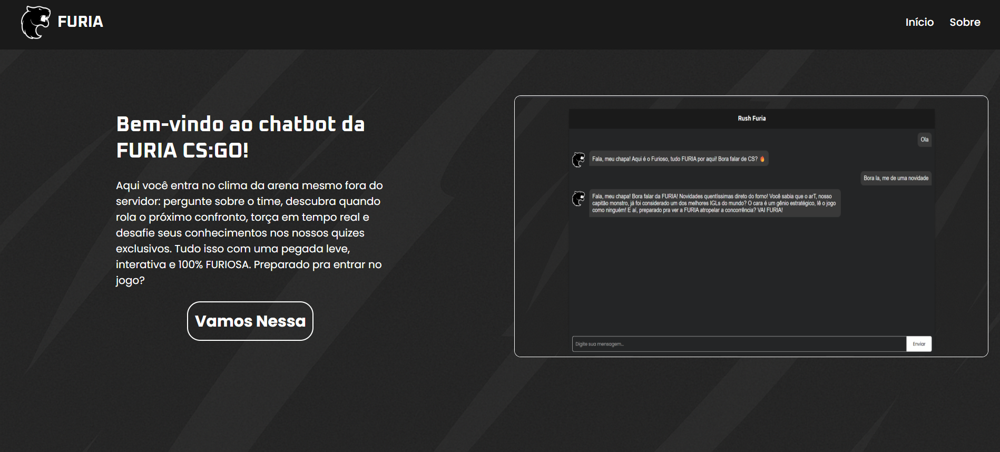
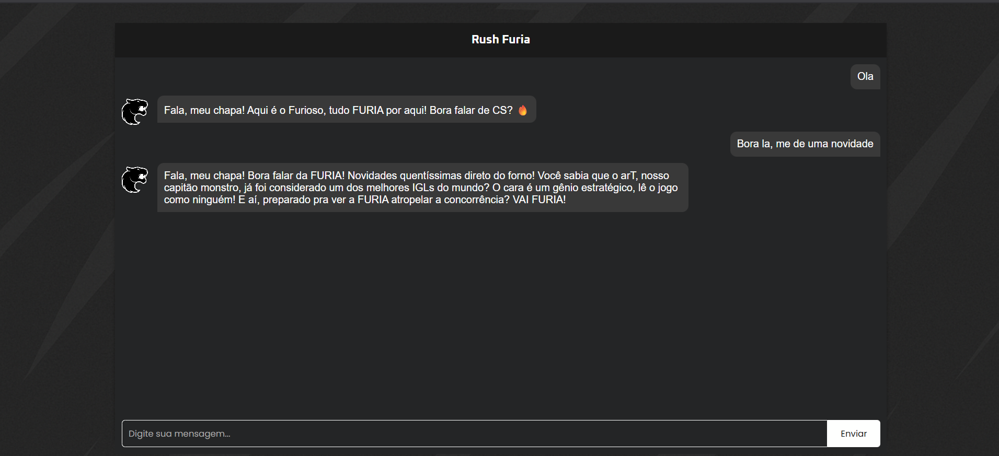

# 🐗 RushFuria

**RushFuria** é um chatbot interativo focado exclusivamente no time de Counter-Strike: Global Offensive da **FURIA Esports**.  
Com uma linguagem empolgada, torcedora e fanática, ele responde perguntas sobre o time, faz quizzes, compartilha curiosidades e até informa o próximo confronto da FURIA!  

Este projeto utiliza **HTML**, **CSS** e **JavaScript** no front-end e **Node.js com Express** no back-end, integrando a API **Gemini (Google Generative AI)** para gerar respostas inteligentes e emocionadas, como um verdadeiro fã da FURIA.

---

## 🏞️ Imagens




---

## 🚀 Tecnologias utilizadas

- HTML5  
- CSS3  
- JavaScript (Vanilla)  
- Node.js (Express)  
- API Gemini da Google (via LangChain)

---

## 🌍 Como acessar o site online

Você pode acessar o chatbot funcionando através do link hospedado no Render:

👉 [https://rushfuria.onrender.com](https://rushfuria.onrender.com)

Nenhuma instalação é necessária — é só abrir o link e começar a conversar com o Furioso, o torcedor mais fanático da FURIA!

---

## 📦 Como baixar e rodar localmente

1. **Clone este repositório** em sua máquina:

   ```bash
   git clone https://github.com/GustavoTeodoroGabilan/ChatBot-FURIA.git
   cd ChatBot-FURIA
   ```

2.  acesse a raiz do projeto e **Instale as dependências**:

      ```bash
      npm install
      ```

3. **Dentro do arquivo`.env`** na raiz do projeto, adicione sua [chave da API Gemini](https://aistudio.google.com/app/apikey?hl=pt-br) :

   ```env
   API_KEY=sua_chave_gemini_aqui
   ```

4. **Rode a aplicação**:

   ```bash
   npm start
   ```

5. Acesse o site no navegador:  
   [http://localhost:3000](http://localhost:3000)

---

## 🤘 Sobre o projeto

Este projeto foi feito com muito carinho e emoção para todos os apaixonados por CS:GO e pela FURIA Esports.  
Sinta-se à vontade para contribuir, abrir issues ou adaptar o bot para outros temas (mas aqui, o coração é todo FURIA 🖤💛).

---

## 🔗 Links

- 🔗 Projeto no GitHub: [https://github.com/GustavoTeodoroGabilan/ChatBot-FURIA](https://github.com/GustavoTeodoroGabilan/ChatBot-FURIA)  
- 🔗 Site no Render: [https://rushfuria.onrender.com](https://rushfuria.onrender.com)